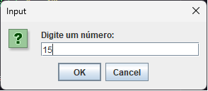
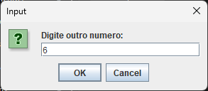
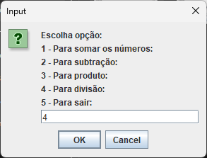
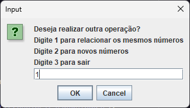
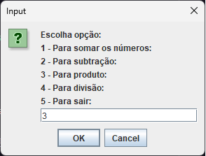
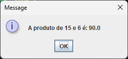
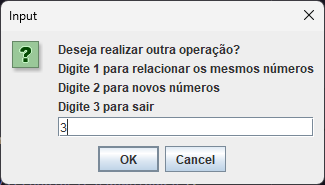

<h1 align="center"> Calculadora Java </h1>

Me chamo Feitosa Junior, tô no início da minha jornada com tecnologia, iniciando o segundo semestre em ciências da computação.
A calculadora pra mim foi um auto desafio, cheguei no final do semestre, já terminando o inicio da lógica de programação com Java, quis me dá o desafio de fazer esse algoritmo sem nenhum spoiler, tentando incluir tudo que tinha visto nos últimos dias. Já ouvia antes que fazer a calculadora era um bom exercício para não esquecer os conceitos então só fui.
  
 

Qual a ideia de deixar aqui um código simples? Eu quero mais! Mas quero lembrar também do quão foi satisfatório o código sair da minha cabeça e copilar kkk, não sem dá um erro antes. 
 

Então, se tiver alguma sugestão de melhoria, ou de outra forma de se desafiar a criar, algo interessante para estudar, qualquer coisa, manda essa ajuda!!  (:
  

  <a href="#-tecnologias">Tecnologias</a>&nbsp;&nbsp;&nbsp;|&nbsp;&nbsp;&nbsp;
  <a href="#-projeto">Projeto</a>&nbsp;&nbsp;&nbsp;|&nbsp;&nbsp;&nbsp;
  <a href="#Para-executar">Para executar</a>

## Tecnologias

Esse projeto foi desenvolvido com as seguintes tecnologias:

- Java
- JDK
- Git e Github

## Projeto

A ideia era construir um algoritmo que realizasse cálculos simples relacionando dois números recebidos pelo usuário, e que ele pudesse escolher qual cálculo fazer com os números. Mas também queria que a execução fosse cíclica e que o usuário, se optasse, relacionaria os mesmos números novamente ou entraria com novos, assim encerrando quando quisesse a execução. Meu primeiro level foi entender o fluxo que ficou mais ou menos assim.

  

## Para executar

Você vai precisar ter o Java Development Kit instalado e configurar as variáveis de ambiente para poder copilar e executar o código.  
O JDK você pode baixar [NESSE LINK](https://www.oracle.com/br/java/technologies/downloads/).

[AQUI](https://www.youtube.com/watch?v=NX_i1sLzz5I) tem um vídeo do queridissimo professor Perini ensinando como instalar e configurar as variaveis de ambiente.

Depois de baixar o código você precisa abrir o CMD dentro da pasta que está o código e executar o comando { javac Calculadora.java } para copilar e depois o comando { java Calculadora } para executar e a janela de entrada de dados irá aparecer.

  
  
  
  
  
  
  
  
  

